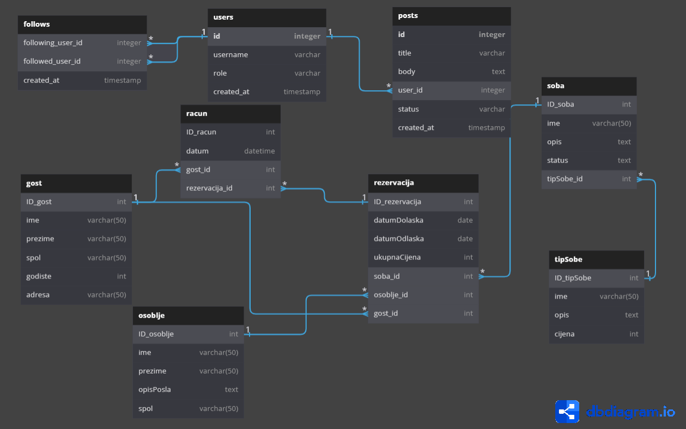

# **Naziv projekta je Hotel**

## Relacijski model ima 6 tablica, a to su:
- Soba, 
- Tip sobe,
- Rezervacija,
- Racun,
- Osoblje,
- Gost.

### _Relacijski model baze podataka implementiran u SQLAlchemy programskom okruženju:_
 
---
## Tehnologije koje su korištene u ovom projektu su:
- Python,
- Docker,
- Kafka, 
- MySql,
- Redis,
- Flask,
- JQuery.
---
## Cilj projekta je:
- Razvoj sustava baziranih na web tehnologijama za upravljanje podacima u bazi podataka,
- Korištenje Docker tehnologije,
- Razvoj aplikacija korištenjem Docker platforme,
- Korištenje JQuery i Flask tehnologija za rad s podacima u stvarnom vremenu,
- Korištenje Kafka i Redis za uspješnu komunikaciju i smanjenje opterećenja na sustav.

### Za razred su korišteni Kafka i JQuery za komunikaciju u stvarnom vremenu.
---
### Aplikacija kroz MySQL bazu podataka osigurava trajnost podataka, a kroz Redis sustav osigurava cache-ing za brzo dohvaćanje podataka. 
### Za komunikaciju u stvarnom vremenu korištena je Kafka.